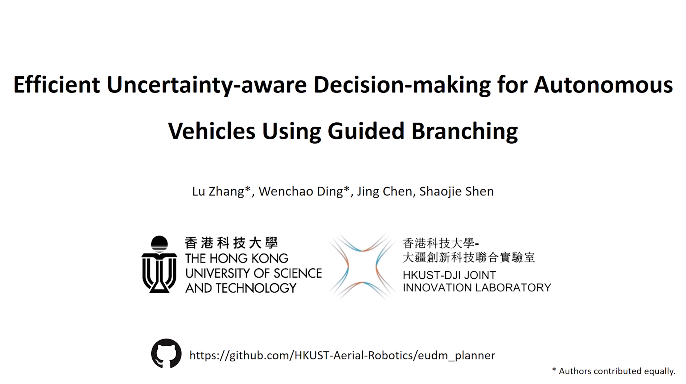

# EUDM Planner

* The code will be released after the paper is accepted.

## Introduction

This is the project page of the paper "**Efficient Uncertainty-aware Decision-making for Autonomous Vehicles Using Guided Branching**" which is submitted to IEEE International Conference on Robotics and Automation (ICRA) 2020.

**Videos:**

