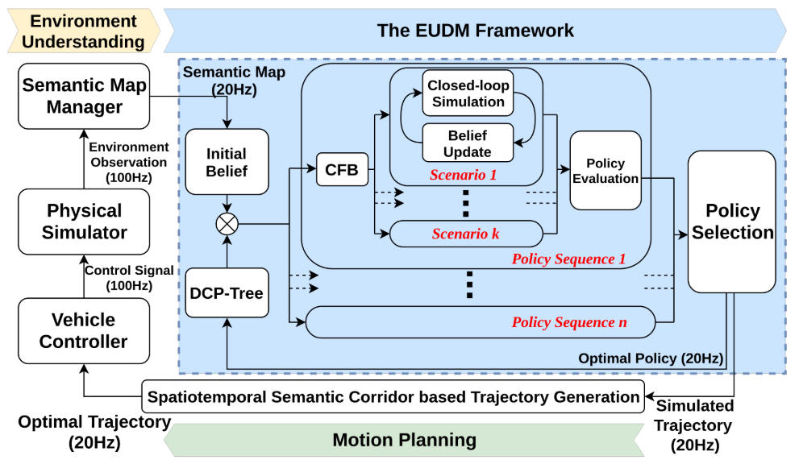

# EUDM Planner

* Notice: The current version is for reference only. The released EUDM planner can be integrated with our [SSC planner](https://github.com/HKUST-Aerial-Robotics/spatiotemporal_semantic_corridor). The whole dependencies and a playable demo will be released in: **https://github.com/HKUST-Aerial-Robotics/HDJI_planning_core**.

## Introduction

This is the project page of the paper "**Efficient Uncertainty-aware Decision-making for Automated Driving Using Guided Branching**" which is accepted by IEEE International Conference on Robotics and Automation (ICRA) 2020.

Our paper is currently available on [arXiv](https://arxiv.org/abs/2003.02746).

* Lu Zhang, Wenchao Ding, Jing Chen and Shaojie Shen. Efficient Uncertainty-aware Decision-making for Automated Driving Using Guided Branching. arXiv preprint arXiv:2003.02746.

* *L. Zhang and W. Ding contributed equally to this project.*

```
@article{zhang2020efficient,
  title={Efficient Uncertainty-aware Decision-making for Automated Driving Using Guided Branching},
  author={Zhang, Lu and Ding, Wenchao and Chen, Jing and Shen, Shaojie},
  journal={arXiv preprint arXiv:2003.02746},
  year={2019}
}
```

**Videos:**

<a href="https://youtu.be/yFNvQjheXCE" target="_blank"></a>

The overall structure is shown as follows:

